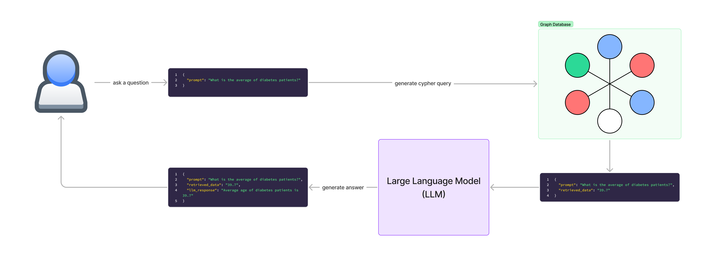

# Graph-Based Modeling and Information Extraction on Health Data

This project demonstrates how to perform graph-based modeling and information extraction from a Neo4j database using Large Language Models (LLMs) via LangChain. The focus is on querying health data stored in a Neo4j graph database and utilizing LLMs for question answering (QA).

---

## Features

- **Neo4j Integration**: Connects to a Neo4j database to access and query health-related graph data.
- **LangChain Support**: Leverages the LangChain library for seamless integration with LLMs.
- **Question Answering**: Provides answers to natural language queries on the health data graph using ChatOpenAI.
- **Configurable Query Execution**: Supports Cypher queries to extract relevant insights from the database.

---

## Requirements

- Python 3.8+
- Neo4j (Database must be set up and running)
- LangChain
- OpenAI API access
- Streamlit